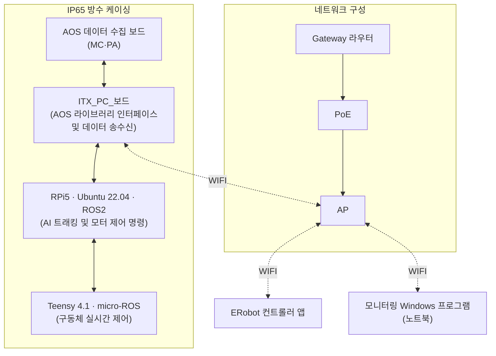
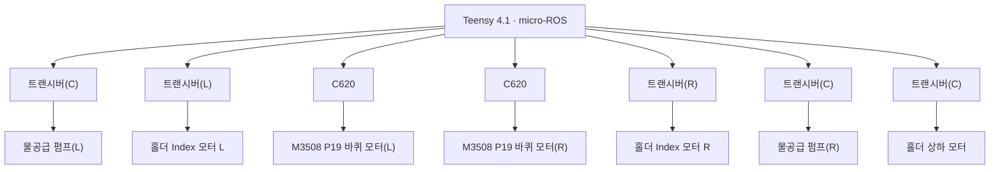

# ERobot 시스템 아키텍처

> 확정 구조 (다이어그램 기준, 2026-07-03). 기존 [[ERUT]]의 "앱→ESP32→UART→Teensy" 구상은 이 구조로 **대체됨** — ESP32 브릿지 대신 ITX PC + RPi5 계층 구조.

## 전체 구성도

**IP65 방수 케이싱 내부 (로봇 본체)**



**Teensy 4.1 하위 구동계**



## 계층별 역할

| 계층 | 담당 | 성격 |
| --- | --- | --- |
| ERobot 컨트롤러 앱 | 사용자 조작 (RN + TypeScript) | UI/명령 발신 |
| 모니터링 Windows 프로그램 | 노트북 관제 | 모니터링 |
| ITX_PC_보드 ([[하드웨어 스펙 시트#3 GIGAIPC iTXL-6412A 산업용 마더보드 — MEHLJAT-SI|iTXL-6412A]]) | AOS 라이브러리 인터페이스·데이터 송수신, Wi-Fi로 외부와 통신하는 관문 | x86 Windows PC |
| RPi5 ([[하드웨어 스펙 시트#2 Raspberry Pi 5 SBC 후보 — 공식 Product Brief|스펙]]) | **Ubuntu 22.04 + ROS2** — AI 트래킹, 모터 제어 명령 생성 | 리눅스 SBC (판단 담당) |
| Teensy 4.1 ([[하드웨어 스펙 시트#1 Teensy 41 제어 MCU — Joy-IT 데이터시트|스펙]]) | **micro-ROS** — 구동체 실시간 제어 | 실시간 MCU (반사신경 담당) |
| AOS 데이터 수집 보드 | MC/PA 초음파 데이터 수집 | 센서 프론트엔드 |

## 구간별 연결 방식 (학습 포인트)

* **① 앱/노트북 ↔ AP ↔ ITX PC : Wi-Fi**
	* Gateway 라우터 → PoE → AP로 현장 무선망 구성. PoE = 랜선 하나로 전원+데이터를 AP에 공급 (AP 위치 자유).
	* 앱은 이 Wi-Fi망을 통해 ITX PC와 통신 (TCP Socket — [[ERUT]] 프로토콜 설계 그대로 유효).
* **② ITX PC ↔ RPi5 : 유선 (방식 미확정 [UNCLEAR])**
	* 케이싱 내부 보드 간 연결. 후보: 이더넷 직결(ROS2 DDS가 IP 기반이라 자연스러움) 또는 USB.
	* iTXL-6412A가 GbE 포트 2개라 하나를 RPi5 직결에 쓰는 구성이 유력.
* **③ RPi5 ↔ Teensy 4.1 : micro-ROS (시리얼 계열)**
	* **micro-ROS 구조**: RPi5에서 `micro-ROS Agent` 실행 ↔ Teensy에서 `micro-ROS Client`(펌웨어) 실행.
	* 전송(transport)은 통상 **USB/UART 시리얼** — Teensy가 ROS2 노드처럼 보이게 되어, RPi5의 ROS2 토픽(`cmd_vel` 등)을 Teensy가 직접 구독.
	* 기존 구상(ESP32가 Wi-Fi→UART 중계)이 필요 없어진 이유: RPi5가 그 자리를 대체하고 ROS2 생태계까지 얹음.
* **④ Teensy ↔ 바퀴 모터 : CAN 버스 (C620 ESC)**
	* **C620** = DJI RoboMaster **M3508 P19** 기어드 모터 전용 ESC(변속기), **CAN 통신으로 제어** (전류 제어 명령·엔코더 피드백).
	* Teensy 4.1은 CAN 컨트롤러 내장([[하드웨어 스펙 시트]] 참조) — 외부에 **CAN 트랜시버**(다이어그램의 '트랜시버' 박스)만 붙이면 됨.
* **⑤ Teensy ↔ 펌프/홀더 모터 : 트랜시버 경유**
	* 물공급 펌프 L/R, 홀더 Index 모터 L/R, 홀더 상하 모터 — 각각 트랜시버(C/L/R) 경유 제어. 구체 프로토콜 미확정 [UNCLEAR] (CAN 공유 버스 또는 개별 드라이버).

## micro-ROS Arduino 구현 참고 (Teensy 펌웨어)

> 출처: [micro-ROS/micro_ros_arduino](https://github.com/micro-ROS/micro_ros_arduino) README (2026-07-03 확인)

* **Teensy 4.1 공식 지원** — Supported 상태 (Teensy 4.0은 Not tested). Teensyduino 1.58.x 기반, 라이브러리 최소 v1.8.5.
* **설치**: 릴리스 페이지에서 ZIP 다운로드 → Arduino IDE `Sketch → Include Library → Add .ZIP Library...`
* **Teensyduino 패치 필수** — `platform.txt`를 micro_ros_arduino의 patched 버전으로 교체해야 빌드됨:
	```bash
	export TEENSYDUINO_VERSION=[버전]
	export ARDUINO_PATH=[경로]
	cd $ARDUINO_PATH/hardware/avr/$TEENSYDUINO_VERSION/
	curl https://raw.githubusercontent.com/micro-ROS/micro_ros_arduino/main/extras/patching_boards/platform_teensy.txt > platform.txt
	```
* **Transport**: README 기준 "Only USB serial transports are provided" — 우리 설계(RPi5↔Teensy USB 시리얼)와 정확히 일치. Wi-Fi transport는 일부 보드(ESP32 계열)용이라 Teensy에선 고려 대상 아님.
* **Agent 실행 (RPi5 쪽)** — Docker 한 줄:
	```bash
	docker run -it --rm -v /dev:/dev --privileged --net=host \
	  microros/micro-ros-agent:humble serial --dev [보드 포트] -v6
	```
	* ROS2 버전 태그(humble/kilted 등)를 RPi5의 ROS2 배포판과 맞출 것. Ubuntu 22.04면 **humble**이 정합.
* **주의**: precompiled 라이브러리는 **정적 메모리 풀이 사전 구성**돼 있음 — 노드/토픽/서비스 수가 기본 한도를 넘으면 colcon.meta 조정 후 재빌드 필요. 예제는 repo `examples/` 폴더 참조.

## 기존 구상에서 달라진 점

| 항목 | 기존 ([[ERUT]]) | 확정 아키텍처 |
| --- | --- | --- |
| Wi-Fi 수신 | ESP32 브릿지 | **ITX PC** (관문) |
| 명령 전달 | 앱→ESP32→UART→Teensy | 앱→ITX PC→**RPi5(ROS2)**→**Teensy(micro-ROS)** |
| 지능 계층 | 없음 (앱이 직접 제어) | **RPi5가 AI 트래킹·모터 명령 생성** |
| 모터 제어 | (미정) | **CAN 버스 + C620 ESC + M3508** |
| 앱 프로토콜 | 자체 바이너리 패킷 | 유효 — 단 수신처가 ITX PC로 변경. ITX PC↔RPi5 구간부터는 ROS2 토픽 |

* 앱 쪽 설계([[ERUT]]의 패킷 규격·지속 연결·Watchdog·개발 도구)는 그대로 유효 — 상대가 ESP32에서 ITX PC로 바뀌었을 뿐.
* Fail-safe(Watchdog)는 여전히 **Teensy 펌웨어 단**에 필수 — 상위 계층(RPi5·ITX PC·Wi-Fi) 어디가 죽어도 구동계는 멈춰야 함.
