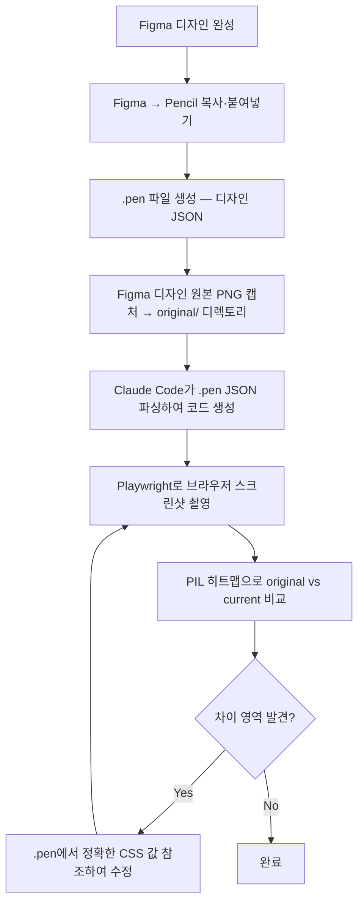

# 디자인 → 코드 일치 워크플로우 (Figma + Pencil + Claude Code)

#figma #pencil #playwright #design-to-code

> Figma 디자인을 코드로 구현할 때, Pencil `.pen` JSON과 Playwright 스크린샷 비교를 통해 **픽셀 단위 일치**를 달성하는 반복 수정 워크플로우

## 전체 프로세스



## 디렉토리 구조

```
project/
├── original/                  ← Figma 디자인 원본 PNG (기준 이미지)
│   ├── 1.main.png
│   ├── 2.회사소개1_인사말.png
│   └── ...
├── pen/                       ← Pencil .pen 파일 (디자인 JSON)
│   ├── main.pen
│   ├── intro-company.pen
│   └── ...
├── screenshot/                ← 비교 작업 디렉토리
│   ├── home/                  ← 페이지별 서브디렉토리
│   │   ├── current.png        ← Playwright 최신 스크린샷
│   │   ├── 01-header.png      ← 섹션별 side-by-side 비교
│   │   ├── 02-hero.png
│   │   └── ...
│   ├── compare.py             ← 히트맵 분석 스크립트
│   └── crop-compare.py        ← 섹션별 크롭 비교 스크립트
└── guide.md                   ← 페이지별 Figma node-id 매핑
```

## Step 1: 준비

### 1-1. Figma 디자인 원본 PNG 캡처

Figma에서 각 페이지 프레임을 **1x 해상도 (1920px 너비)** PNG로 내보내서 `original/` 디렉토리에 저장한다.

### 1-2. Pencil에 디자인 복사

1. Figma에서 프레임 선택 → `Ctrl+C`
2. VS Code Pencil 캔버스에서 `Ctrl+V`
3. `.pen` 파일로 저장 → `pen/` 디렉토리에 페이지별 저장

### 1-3. guide.md 작성

각 페이지별 Figma node-id와 .pen 파일명을 매핑하는 가이드 문서를 작성한다.

```markdown
# 로그인 페이지 (login.pen)
https://www.figma.com/design/{file-key}?node-id=254-7660&m=dev

# 회사 소개 (intro-company.pen)
https://www.figma.com/design/{file-key}?node-id=249-2490&m=dev
```

## Step 2: .pen JSON에서 CSS 값 추출

`.pen` 파일은 디자인의 **정확한 수치 데이터**를 JSON으로 담고 있다. 코드 작성 시 이 값을 기준으로 한다.

### 추출 스크립트 (Node.js)

```javascript
// pen/extract-all.cjs
const fs = require('fs');
const data = JSON.parse(fs.readFileSync('pen/main.pen', 'utf8'));

function inspect(node, depth) {
  const name = node.name || '';
  const indent = '  '.repeat(depth);

  if (node.type === 'frame' && name) {
    const info = [];
    if (node.width) info.push('w:' + node.width);
    if (node.height) info.push('h:' + node.height);
    if (node.gap !== undefined) info.push('gap:' + node.gap);
    if (node.padding) info.push('pad:' + JSON.stringify(node.padding));
    if (node.layout) info.push('lay:' + node.layout);
    if (node.justifyContent) info.push('jc:' + node.justifyContent);
    if (node.alignItems) info.push('ai:' + node.alignItems);
    if (node.fill && typeof node.fill === 'string') info.push('bg:' + node.fill);
    if (node.cornerRadius) info.push('r:' + JSON.stringify(node.cornerRadius));
    console.log(indent + '[F] ' + name + ' | ' + info.join(' | '));
  }

  if (node.type === 'text' && node.content && node.content.trim()) {
    const c = node.content.substring(0, 80).replace(/\n/g, ' ');
    console.log(indent + '[T] ' + node.fontSize + 'px | ' +
      (node.fontWeight || 'normal') + ' | ' +
      (typeof node.fill === 'string' ? node.fill : '?') + ' >>> ' + c);
  }

  if (node.children && depth < 8) {
    node.children.forEach(ch => inspect(ch, depth + 1));
  }
}
inspect(data, 0);
```

### .pen 주요 속성 매핑

| .pen 속성 | CSS/Tailwind 대응 |
|-----------|------------------|
| `w:380` | `w-[380px]` |
| `h:50` | `h-[50px]` |
| `gap:30` | `gap-[30px]` |
| `pad:[20,30]` | `py-[20px] px-[30px]` |
| `pad:[0,0,20,20]` | `pt-0 pr-0 pb-[20px] pl-[20px]` |
| `r:10` | `rounded-[10px]` |
| `bg:#03569fff` | `bg-[#03569f]` |
| `border:#ddddddff` | `border border-[#ddd]` |
| `jc:center` | `justify-center` |
| `jc:space_between` | `justify-between` |
| `ai:center` | `items-center` |
| `lay:vertical` | `flex flex-col` |
| `fontSize: 20, fontWeight: 500` | `text-[20px] font-medium` |
| `lh:1.875` | `leading-[1.875]` |
| `ls:2` | `tracking-[2px]` |

## Step 3: Playwright 스크린샷 촬영

**반드시 original 이미지와 동일한 뷰포트(1920x1080, deviceScaleFactor: 1)**로 찍는다.

```javascript
const { chromium } = require('playwright');
(async () => {
  const browser = await chromium.launch();
  const ctx = await browser.newContext({
    viewport: { width: 1920, height: 1080 },
    deviceScaleFactor: 1  // original과 동일한 해상도
  });
  const tab = await ctx.newPage();
  await tab.goto('http://localhost:5173', { waitUntil: 'networkidle' });
  await tab.waitForTimeout(1000);
  await tab.screenshot({ path: 'screenshot/home/current.png', fullPage: true });
  await browser.close();
})();
```

## Step 4: 섹션별 Side-by-Side 비교

original과 current를 섹션별로 크롭하여 나란히 배치한다. **눈으로 직접 비교**가 핵심이다.

```python
# screenshot/crop-compare.py
from PIL import Image, ImageDraw
import numpy as np

design = Image.open('original/1.main.png').convert('RGB')
current = Image.open('screenshot/home/current.png').convert('RGB')

sections = [
    ("01-header",        0,   70,   0,   70),
    ("02-hero",          70,  937,  70,  937),
    ("03-techservice",   937, 2700, 937, 2700),
    # ... 섹션별 Y 좌표 정의
]

for name, dy1, dy2, cy1, cy2 in sections:
    d_crop = design.crop((0, dy1, 1920, dy2))
    c_crop = current.crop((0, cy1, 1920, cy2))
    h = min(d_crop.size[1], c_crop.size[1])

    combined = Image.new('RGB', (1920 * 2 + 10, h), (128, 128, 128))
    combined.paste(d_crop.crop((0,0,1920,h)), (0, 0))
    combined.paste(c_crop.crop((0,0,1920,h)), (1930, 0))
    combined.save(f'screenshot/home/{name}.png')
```

## Step 5: 반복 수정 루프

### 비교 → 수정 → 재촬영 사이클

```
1. screenshot/home/ 의 side-by-side 이미지를 확인
2. 차이가 보이는 영역 특정
3. .pen JSON에서 해당 영역의 정확한 CSS 값 조회
4. 코드 수정
5. Playwright로 재촬영
6. 다시 1번부터 반복
```

### 핵심 원칙

| 원칙 | 설명 |
|------|------|
| **이미지 = 전체 흐름** | original PNG로 레이아웃 구조, 간격, 크기 비교 |
| **.pen = 정확한 값** | padding, gap, font-size, color 등 수치는 .pen에서 참조 |
| **히트맵 수치 맹신 금지** | 흰 배경 영역은 수치가 높게 나와도 실제 차이가 클 수 있음 |
| **카드 높이 고정** | 같은 유형의 카드는 반드시 동일 높이, 텍스트 넘침 시 ellipsis |
| **이미지 에셋 분리** | 이미지 없어도 레이아웃/간격은 100% 일치시킨 후 이미지 교체 |

### 자주 발생하는 실수

| 실수 | 해결 |
|------|------|
| Button 컴포넌트 기본 패딩과 `w-[110px]` 충돌 → 텍스트 2줄 | `whitespace-nowrap` 추가하거나 Link로 직접 스타일링 |
| `flex-wrap` gap이 행·열 동시 적용 → 의도치 않은 세로 간격 | `gap-x-[30px] gap-y-[30px]` 분리 |
| 히트맵 90%라서 완료라고 판단 → 실제로는 레이아웃 차이 | 반드시 side-by-side 이미지로 **눈으로 확인** |
| `.pen`의 `pad:[0,20]`을 `p-[20px]`로 적용 | `pad:[vertical, horizontal]`이므로 `py-0 px-[20px]` |
| 디자인 해상도 불일치 (2x vs 1x) | deviceScaleFactor를 original과 동일하게 맞춤 |

## 페이지별 작업 진행 방법

각 페이지마다 `screenshot/{page-name}/` 디렉토리를 만들어 진행한다.

```
screenshot/
├── home/           ← 메인 페이지
├── greeting/       ← 인사말 페이지
├── history/        ← 연혁 페이지
├── service-list/   ← 기술서비스 목록
├── news/           ← 회사소식
└── ...
```

각 디렉토리에는:
- `current.png` — 최신 Playwright 스크린샷
- `01-{section}.png` ~ — 섹션별 side-by-side 비교 이미지
- 필요 시 `heatmap.png` — 전체 히트맵

## 참고 자료

- [Pencil × Claude Code 워크플로우 (Zenn)](https://zenn.dev/saqoosha/articles/pencil-ai-design-with-claude-code)[^1]
- [Pencil.dev 공식 문서](https://docs.pencil.dev/getting-started/ai-integration)

[^1]: PIL 히트맵으로 매칭률을 수치화하고, 낮은 영역을 반복 수정하는 접근법의 원본 사례
